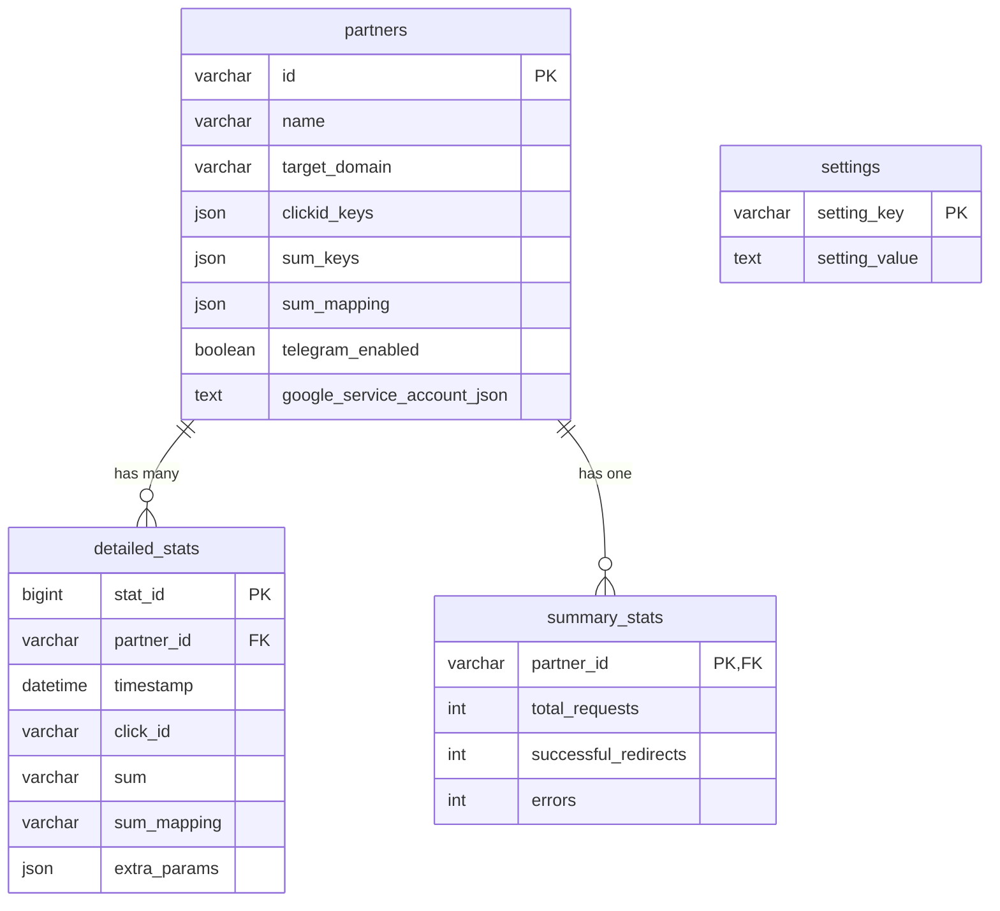

# Database Schema

Complete database structure for the Professional Affiliate Tracking System.

## 📊 Schema Overview

The system uses a normalized MySQL database with 4 main tables optimized for performance and data integrity.

```sql
Database: affiliate_tracker
Character Set: utf8mb4
Collation: utf8mb4_unicode_ci
```

## 🗄️ Table Structure

### 1. partners
Central table storing partner configurations and settings.

```sql
CREATE TABLE `partners` (
    `id` VARCHAR(100) NOT NULL PRIMARY KEY COMMENT 'Unique partner identifier',
    `name` VARCHAR(255) NOT NULL COMMENT 'Partner display name',
    `notes` TEXT COMMENT 'Optional partner notes and descriptions',
    `target_domain` VARCHAR(255) NOT NULL COMMENT 'Target redirect domain',
    `clickid_keys` JSON COMMENT 'Array of parameter names for click tracking',
    `sum_keys` JSON COMMENT 'Array of parameter names for sum values',
    `sum_mapping` JSON COMMENT 'Object mapping original sums to new values',
    `logging_enabled` BOOLEAN DEFAULT TRUE COMMENT 'Enable file logging for this partner',
    `telegram_enabled` BOOLEAN DEFAULT TRUE COMMENT 'Enable Telegram notifications',
    `telegram_whitelist_enabled` BOOLEAN DEFAULT FALSE COMMENT 'Enable Telegram keyword filtering',
    `telegram_whitelist_keywords` JSON COMMENT 'Keywords for Telegram filtering',
    `ip_whitelist_enabled` BOOLEAN DEFAULT FALSE COMMENT 'Enable IP address filtering',
    `allowed_ips` JSON COMMENT 'Array of allowed IP addresses',
    `partner_telegram_enabled` BOOLEAN DEFAULT FALSE COMMENT 'Enable partner-specific Telegram bot',
    `partner_telegram_bot_token` VARCHAR(255) DEFAULT NULL COMMENT 'Partner-specific bot token',
    `partner_telegram_channel_id` VARCHAR(255) DEFAULT NULL COMMENT 'Partner-specific channel ID',
    `google_sheet_name` VARCHAR(255) DEFAULT NULL COMMENT 'Google Sheets worksheet name',
    `google_spreadsheet_id` VARCHAR(255) DEFAULT NULL COMMENT 'Google Spreadsheet ID',
    `google_service_account_json` TEXT DEFAULT NULL COMMENT 'Google Service Account JSON credentials',
    `created_at` TIMESTAMP DEFAULT CURRENT_TIMESTAMP COMMENT 'Partner creation timestamp'
) ENGINE=InnoDB DEFAULT CHARSET=utf8mb4 COLLATE=utf8mb4_unicode_ci;
```

#### Example Data
```json
{
    "id": "partner001",
    "name": "Premium Affiliate Network",
    "target_domain": "network.example.com/track",
    "clickid_keys": ["clickid", "cid", "click_id"],
    "sum_keys": ["sum", "payout", "revenue"],
    "sum_mapping": {"100": "80", "50": "40", "25": "20"},
    "allowed_ips": ["64.227.66.201", "192.168.1.100"],
    "telegram_whitelist_keywords": ["purchase", "sale", "conversion"]
}
```

### 2. detailed_stats
Stores individual conversion records with complete tracking data.

```sql
CREATE TABLE `detailed_stats` (
    `stat_id` BIGINT UNSIGNED NOT NULL AUTO_INCREMENT PRIMARY KEY COMMENT 'Unique statistics record ID',
    `partner_id` VARCHAR(100) NOT NULL COMMENT 'Reference to partner',
    `timestamp` DATETIME NOT NULL COMMENT 'Conversion timestamp',
    `url` TEXT COMMENT 'Original postback URL',
    `status` SMALLINT COMMENT 'HTTP response status code',
    `click_id` VARCHAR(255) COMMENT 'Extracted click identifier',
    `response` TEXT COMMENT 'Target server response (truncated)',
    `sum` VARCHAR(50) COMMENT 'Original sum value from postback',
    `sum_mapping` VARCHAR(50) COMMENT 'Mapped sum value after transformation',
    `extra_params` JSON COMMENT 'Additional URL parameters',
    
    INDEX `idx_partner_id` (`partner_id`),
    INDEX `idx_timestamp` (`timestamp`),
    INDEX `idx_click_id` (`click_id`),
    INDEX `idx_status` (`status`),
    
    CONSTRAINT `fk_partner_id_detailed` 
        FOREIGN KEY (`partner_id`) 
        REFERENCES `partners` (`id`) 
        ON DELETE CASCADE ON UPDATE CASCADE
) ENGINE=InnoDB DEFAULT CHARSET=utf8mb4 COLLATE=utf8mb4_unicode_ci;
```

#### Example Record
```json
{
    "stat_id": 12345,
    "partner_id": "partner001",
    "timestamp": "2024-01-15 14:30:25",
    "url": "https://domain.com/track/postback.php?pid=partner001&clickid=abc123&sum=50.00&utm_source=google",
    "status": 200,
    "click_id": "abc123",
    "response": "Success: Conversion recorded",
    "sum": "50.00",
    "sum_mapping": "40.00",
    "extra_params": {"utm_source": "google", "utm_campaign": "winter_sale"}
}
```

### 3. summary_stats  
Aggregated statistics for quick dashboard display.

```sql
CREATE TABLE `summary_stats` (
    `partner_id` VARCHAR(100) NOT NULL PRIMARY KEY COMMENT 'Partner identifier',
    `total_requests` INT UNSIGNED NOT NULL DEFAULT 0 COMMENT 'Total postback requests received',
    `successful_redirects` INT UNSIGNED NOT NULL DEFAULT 0 COMMENT 'Successful redirect responses',
    `errors` INT UNSIGNED NOT NULL DEFAULT 0 COMMENT 'Failed requests and errors',
    
    CONSTRAINT `fk_partner_id_summary` 
        FOREIGN KEY (`partner_id`) 
        REFERENCES `partners` (`id`) 
        ON DELETE CASCADE ON UPDATE CASCADE
) ENGINE=InnoDB DEFAULT CHARSET=utf8mb4 COLLATE=utf8mb4_unicode_ci;
```

#### Example Data
```json
{
    "partner_id": "partner001",
    "total_requests": 1250,
    "successful_redirects": 1180,
    "errors": 70
}
```

### 4. settings
Global system configuration and settings.

```sql
CREATE TABLE `settings` (
    `setting_key` VARCHAR(50) NOT NULL PRIMARY KEY COMMENT 'Configuration key identifier',
    `setting_value` TEXT COMMENT 'Configuration value (JSON or string)'
) ENGINE=InnoDB DEFAULT CHARSET=utf8mb4 COLLATE=utf8mb4_unicode_ci;
```

#### Default Settings
```sql
INSERT INTO settings (setting_key, setting_value) VALUES
('telegram_globally_enabled', 'true'),
('telegram_bot_token', ''),
('telegram_channel_id', ''),
('curl_timeout', '10'),
('curl_connect_timeout', '5'),
('curl_ssl_verify', 'true'),
('curl_returntransfer', 'true'),
('curl_followlocation', 'true');
```

## 🔗 Relationships



## 📈 Performance Optimization

### Indexes
```sql
-- Primary indexes (automatically created)
ALTER TABLE partners ADD PRIMARY KEY (id);
ALTER TABLE detailed_stats ADD PRIMARY KEY (stat_id);
ALTER TABLE summary_stats ADD PRIMARY KEY (partner_id);
ALTER TABLE settings ADD PRIMARY KEY (setting_key);

-- Additional performance indexes
ALTER TABLE detailed_stats ADD INDEX idx_partner_timestamp (partner_id, timestamp);
ALTER TABLE detailed_stats ADD INDEX idx_partner_status (partner_id, status);
ALTER TABLE detailed_stats ADD INDEX idx_timestamp_status (timestamp, status);
```

### Query Optimization Examples

#### Fast Partner Statistics
```sql
-- Optimized query for dashboard stats
SELECT 
    p.id,
    p.name,
    COALESCE(ss.total_requests, 0) as total_requests,
    COALESCE(ss.successful_redirects, 0) as successful_redirects,
    COALESCE(ss.errors, 0) as errors
FROM partners p
LEFT JOIN summary_stats ss ON p.id = ss.partner_id
ORDER BY p.name;
```

#### Recent Conversions
```sql
-- Get recent conversions with pagination
SELECT 
    timestamp,
    click_id,
    sum,
    sum_mapping,
    status,
    extra_params
FROM detailed_stats 
WHERE partner_id = ? 
    AND timestamp >= DATE_SUB(NOW(), INTERVAL 24 HOUR)
ORDER BY timestamp DESC 
LIMIT 50 OFFSET ?;
```

#### Profit Calculation
```sql
-- Calculate partner profit for date range
SELECT 
    partner_id,
    SUM(CAST(COALESCE(sum, 0) AS DECIMAL(10,2))) as total_revenue,
    SUM(CAST(COALESCE(sum_mapping, 0) AS DECIMAL(10,2))) as total_payout,
    SUM(CAST(COALESCE(sum, 0) AS DECIMAL(10,2))) - 
    SUM(CAST(COALESCE(sum_mapping, 0) AS DECIMAL(10,2))) as profit
FROM detailed_stats 
WHERE timestamp >= ? AND timestamp <= ?
GROUP BY partner_id;
```

## 🗜️ Storage Considerations

### Data Retention Policy
```sql
-- Auto-cleanup old detailed records (keep last 1000 per partner)
DELETE ds1 FROM detailed_stats ds1
INNER JOIN (
    SELECT stat_id 
    FROM detailed_stats ds2 
    WHERE ds2.partner_id = ds1.partner_id 
    ORDER BY timestamp DESC 
    LIMIT 1000, 18446744073709551615
) ds_to_delete ON ds1.stat_id = ds_to_delete.stat_id;
```

### Partitioning for Large Datasets
```sql
-- Partition detailed_stats by month for better performance
ALTER TABLE detailed_stats
PARTITION BY RANGE (YEAR(timestamp) * 100 + MONTH(timestamp)) (
    PARTITION p202401 VALUES LESS THAN (202402),
    PARTITION p202402 VALUES LESS THAN (202403),
    PARTITION p202403 VALUES LESS THAN (202404),
    -- Add more partitions as needed
    PARTITION p999999 VALUES LESS THAN MAXVALUE
);
```

## 🔧 Maintenance Queries

### Database Health Check
```sql
-- Check table sizes
SELECT 
    table_name AS 'Table',
    ROUND(((data_length + index_length) / 1024 / 1024), 2) AS 'Size (MB)',
    table_rows AS 'Rows'
FROM information_schema.tables 
WHERE table_schema = 'affiliate_tracker'
ORDER BY (data_length + index_length) DESC;
```

### Index Usage Analysis
```sql
-- Check index effectiveness
SELECT 
    TABLE_NAME,
    INDEX_NAME,
    SEQ_IN_INDEX,
    COLUMN_NAME,
    CARDINALITY
FROM information_schema.STATISTICS 
WHERE TABLE_SCHEMA = 'affiliate_tracker'
ORDER BY TABLE_NAME, INDEX_NAME, SEQ_IN_INDEX;
```

### Data Quality Checks
```sql
-- Find partners without recent activity
SELECT p.id, p.name, MAX(ds.timestamp) as last_activity
FROM partners p
LEFT JOIN detailed_stats ds ON p.id = ds.partner_id
GROUP BY p.id, p.name
HAVING last_activity < DATE_SUB(NOW(), INTERVAL 7 DAY) 
    OR last_activity IS NULL;

-- Find records with missing click_ids
SELECT COUNT(*) as missing_clickids
FROM detailed_stats 
WHERE click_id IS NULL OR click_id = '';

-- Check for invalid JSON in partners table
SELECT id, name 
FROM partners 
WHERE NOT JSON_VALID(clickid_keys) 
   OR NOT JSON_VALID(sum_keys) 
   OR NOT JSON_VALID(sum_mapping);
```

## 🚀 Migration Scripts

### Upgrade from v1.0 to v2.0
```sql
-- Add Google Sheets integration columns
ALTER TABLE partners 
ADD COLUMN google_spreadsheet_id VARCHAR(255) NULL COMMENT 'Partner-specific Google Spreadsheet ID' AFTER google_sheet_name,
ADD COLUMN google_service_account_json TEXT NULL COMMENT 'Partner-specific Google Service Account JSON credentials' AFTER google_spreadsheet_id;

-- Remove global Google Sheets setting
DELETE FROM settings WHERE setting_key = 'google_spreadsheet_id';

-- Add index for better performance
CREATE INDEX idx_partners_google_spreadsheet_id ON partners(google_spreadsheet_id);
```

### Data Migration Example
```sql
-- Migrate global sum mapping to partner-specific
UPDATE partners 
SET sum_mapping = JSON_OBJECT('100', '80', '50', '40', '25', '20')
WHERE sum_mapping IS NULL OR sum_mapping = '{}';
```

## 📊 Backup and Recovery

### Full Backup
```bash
# Complete database backup
mysqldump --single-transaction --routines --triggers \
  -u root -p affiliate_tracker > affiliate_tracker_backup_$(date +%Y%m%d).sql

# Structure only backup
mysqldump --no-data -u root -p affiliate_tracker > affiliate_tracker_structure.sql
```

### Selective Backup
```bash
# Partners and settings only (configuration backup)
mysqldump -u root -p affiliate_tracker partners settings > config_backup.sql

# Recent statistics only (last 30 days)
mysqldump -u root -p affiliate_tracker detailed_stats \
  --where="timestamp >= DATE_SUB(NOW(), INTERVAL 30 DAY)" > recent_stats.sql
```

### Recovery
```bash
# Full database restore
mysql -u root -p affiliate_tracker < affiliate_tracker_backup_20240115.sql

# Partial restore (structure only)
mysql -u root -p affiliate_tracker < affiliate_tracker_structure.sql
```

---

📋 **Database Schema Complete!** This schema supports high-performance affiliate tracking with scalability and data integrity.

> 💡 **Pro Tip**: Regularly monitor table sizes and query performance, especially the `detailed_stats` table which grows quickly in high-traffic scenarios.

**Related Guides**:
- [Installation Guide](Installation-Guide) - Database setup instructions
- [Performance Tuning](Performance-Tuning) - Optimization techniques
- [Backup Strategy](Backup-Strategy) - Data protection methods